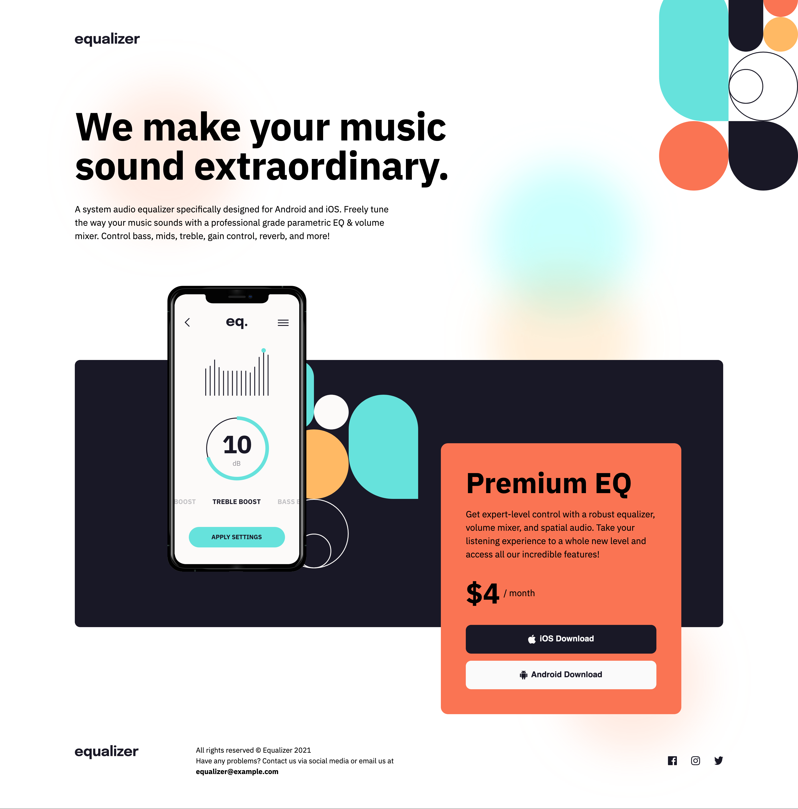

# Frontend Mentor - Equalizer landing page solution

This is a solution to the [Equalizer landing page challenge on Frontend Mentor](https://www.frontendmentor.io/challenges/equalizer-landing-page-7VJ4gp3DE). Frontend Mentor challenges help you improve your coding skills by building realistic projects. 

## Table of contents

- [Overview](#overview)
  - [The challenge](#the-challenge)
  - [Screenshot](#screenshot)
  - [Links](#links)
- [My process](#my-process)
  - [Built with](#built-with)
  - [What I learned](#what-i-learned)
  - [Continued development](#continued-development)
  - [Useful resources](#useful-resources)
- [Author](#author)

## Overview

### The challenge

Users should be able to:

- View the optimal layout depending on their device's screen size
- See hover states for interactive elements

### Screenshot

### Links

- Solution URL: ([https://your-solution-url.com](https://github.com/a-lebel/Landing_project))
- Live Site URL: ([https://your-live-site-url.com](https://a-lebel.github.io/Landing_project/))

## My process

### Built with

- Semantic HTML5 markup
- CSS custom properties
- Flexbox

### What I learned

Throughout this project, I deepened my understanding of responsive design, particularly how to manage overlapping elements effectively. One of the more challenging aspects was ensuring that phone image and the price card would overlap in smaller devices, and the go full bleed in mobile.

### Continued development

In future projects, I plan to focus on:

Advanced CSS Layouts: Further refining my skills with CSS Grid and Flexbox to handle more complex layouts.
Accessibility: Ensuring my projects are accessible to users with disabilities by following ARIA guidelines and improving keyboard navigation.
JavaScript Interactivity: Adding more dynamic elements using vanilla JavaScript or frameworks like React.

### Useful resources

- MDN Web Docs - Flexbox - This comprehensive guide helped me understand Flexbox, which I used extensively in this project.
- CSS-Tricks - A Complete Guide to Flexbox - This guide provided clear examples and explanations that were invaluable when implementing the layout.
- Cody in VSCode

## Author

- Website - Alejandra Le Bel(https://www.alebeldesign.com)
- Frontend Mentor - @a-lebel(https://www.frontendmentor.io/profile/a-lebel)
- Behance - Alejandra Le Bel(https://www.behance.net/a-lebel)

